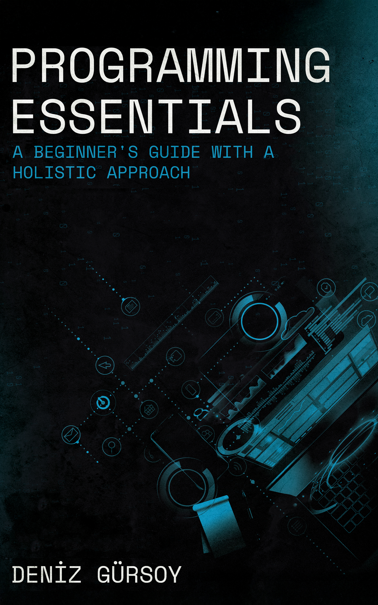

# Programming Essentials: A Beginner's Guide with a Holistic Approach

If you're interested in learning programming with no prior experience, this book is for you. *Programming Essentials* 
offers a unique approach to teaching. It introduces fundamental programming concepts through case studies. 
These concepts are applicable across most programming languages. The book explains why these concepts are important and 
demonstrates their implementation using the **Go** language. This method is known as *abstract teaching*.

Compared to other programming books, you'll also learn:
- The stages of learning with *Shu Ha Ri*
- How programs are executed in Linux
- Basic Linux commands
- How to develop code via the terminal without complex tools
- How to access course materials and settings using Docker to ensure consistency across different environments
